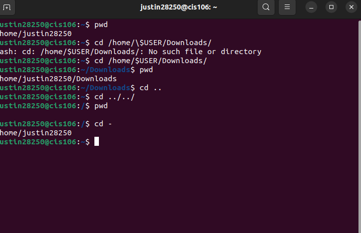
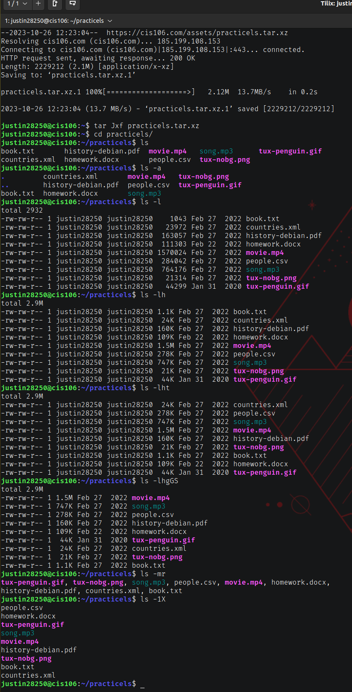
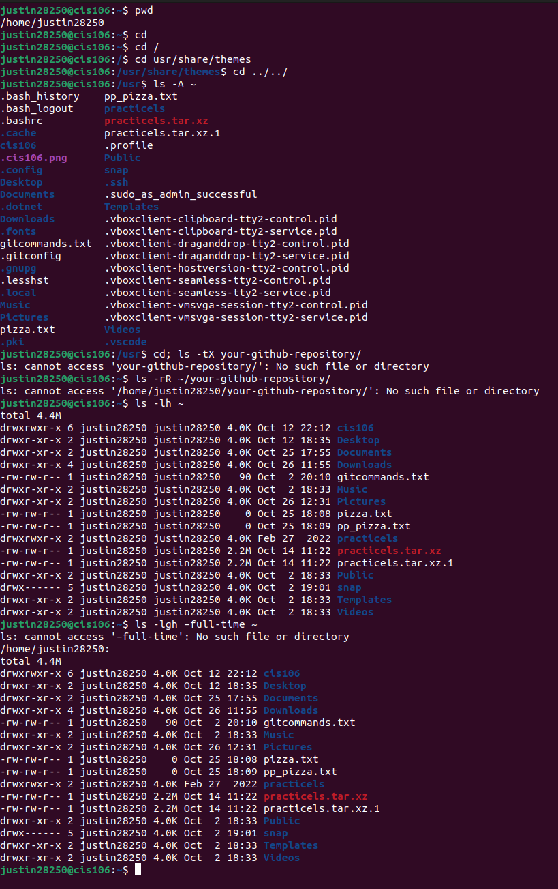
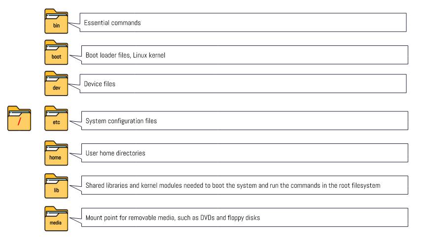
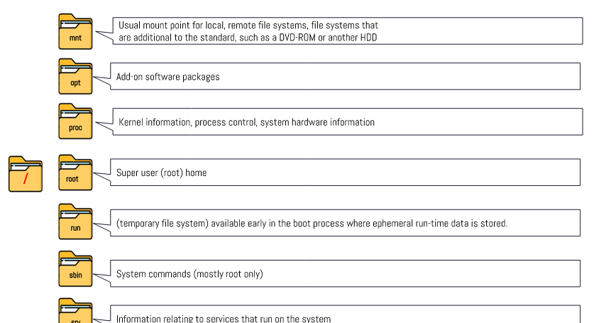

# Week Report 4

## Practice from the presentation The Linux File system:
### Practice 1
 
### Practice 2
 
### Practice 3
 

## The Linux File system directories and their purpose:

 
 

## All the commands for navigating the filesystem

| Command | What it does             | Syntax      | Example        |
| ------- | ------------------------ | ----------- | -------------- |
| pwd     | prints current directory | pwd         | `pwd`          |
| cd      | description here         | syntax here | `example here` |
| ls      | description here         | syntax here | `example here` |

## Basic terminology
* **File system:** The  way files are stored and organized
* **Current directory:** The directory where you are at the moment
* **parent directory:** you can move forward to a subdirectory or backwards to the previous directory
* **the difference between your home directory and the home directory:** When you open the file manager, your current working directory is your home directory. While every user in the system has a home directory.
* **pathname:** indicates the location of the file in the filesystem
* **relative path:** the location of a file starting a the root of the file system
* **absolute path:** the location of a file starting from the current working directory or a directory that is located inside the current working directory 

