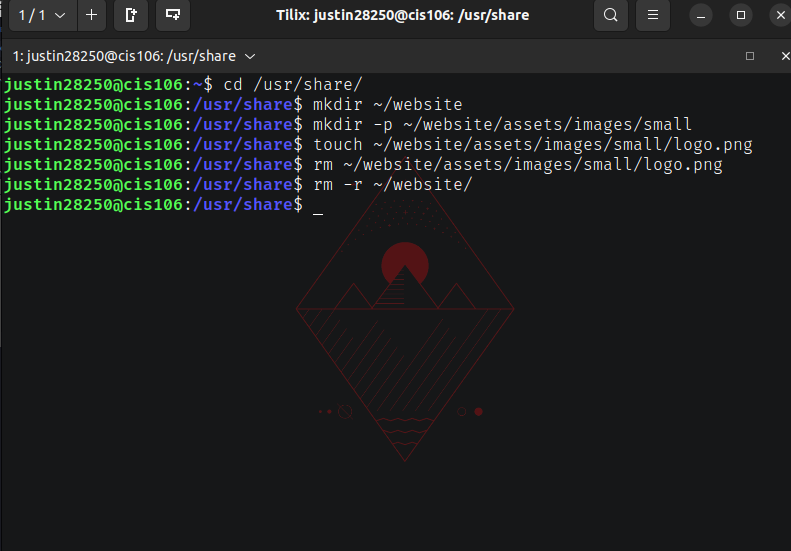

# Week Report 5

## Answer to questions:

* **What are command Options?**
  * Commands are often followed bpy options that modify/enhance their behavior.
* **What are Command Arguments?**
  * Commands are also followed by arguments which are the items the command acts on. This can be a file or directory.
* **Which command is used for creating directories? Provide at least 3 examples.**
the command is mkdir.
* example 1: 
  * Create a directory: "mkdir potatoes"
* example 2: 
    create multiple directories: "mkdir movies ~/Download/games ~/Documents/hw
* **What does the touch command do? Provide at least 3 examples.**
  * touch is used for creating files
  * Examples: 
    * **touch list**: To create a file called list
    * **touch list_of_cars.txt script.py names.csv**: To create several files
    * **touch ~/Downloads/games.txt**: To create a file using absolute path
* **How do you remove a file? Provide an example.**
  * **rm** removes files
  * Example: 
    * Remove a file: **rm list**  
* **How do you remove a directory and can you remove non-empty directories in Linux? Provide an example**
  * **rm** by default does not removes directories. To  remove a directory use **rm** with the -r option
  * In Linux and other Nix systems you cannot remove non empty directories.
  * To remove empty directories use the **rmdir** command
  * Remove an empty directory
    * **rmdir Downloads/games**
* **Explain the mv and cp command. Provide at least 2 examples of each**  
* **mv** moves and renames directories
* To move a file from a directory to another using relative path: **mv Downloads/homework.pdf Documents/**
* To move a a directory from one directory to another using absolute path: **sudo mv ~/Downloads/theme /usr/share/themes**
* **cp** copies files/directories from a source to a destination
* To copy a file: **cp Downloads/wallpapers.zip. Pictures/**
* To copy a directory with absolute path: **cp -r ~/Downloads/wallpapers ~/Pictures/**

### Practice 1

### Practice 2

### Practice 3

### Practice 4
